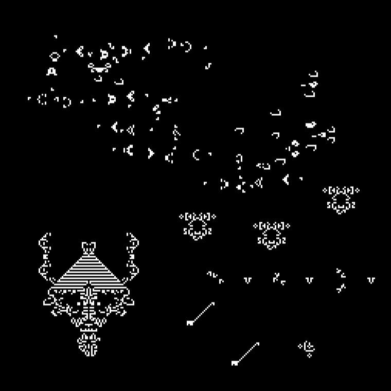

Interactive implementation of **Conway's Game of Life** written in Haxe and three.js. Try it now [in your browser](http://www.samcodes.co.uk/project/game-of-life/).

## Features
* Interact with thousands of Game of Life patterns, or create new ones in realtime.
* Speed up, slow down, step, pause and clear the simulation.
* Create and share snapshots of the simulation state.

## Usage

Try the [demo](http://www.samcodes.co.uk/project/game-of-life/) and simulate Life. Here it is in action:

## How It Works
The [Game of Life](https://en.wikipedia.org/wiki/Conway%27s_Game_of_Life) is a [cellular automaton](https://en.wikipedia.org/wiki/Cellular_automaton) invented by [John Conway](https://en.wikipedia.org/wiki/John_Horton_Conway) in 1970. It is a simulation that takes place on a two-dimensional orthogonal grid of square cells, each of which can either be dead or alive.

Each time the simulation is updated, every cell in the grid interacts with its eight neighboring cells in accordance with these four rules:

* Any live cell with fewer than two living neighbours dies (isolation).
* Any cell with two or three living neighbours survives this time (survival).
* Any cell with more than three living neighbours dies (overpopulation).
* Any dead cell with three living neighbours comes to life (reproduction).

Conway designed the rules to produce interesting results - even self replicating patterns are possible. Read more [here](https://en.wikipedia.org/wiki/Conway%27s_Game_of_Life).

## Notes
* The embedded patterns come from the [LifeWiki](http://www.conwaylife.com/wiki/Main_Page) pattern collection, and have various origins - all credit goes to the creators.
* This project was inspired by [Golly](https://sourceforge.net/projects/golly/), a cross-platform simulator for the Game of Life and other cellular automata.
* If you have any questions or suggestions then [get in touch](http://samcodes.co.uk/contact) or open an issue.

## License
* The Haxe and webpage code here, but not the pattern files, is licensed as [GPLv3](https://www.gnu.org/licenses/quick-guide-gplv3.en.html).
* The [noUiSlider](https://github.com/leongersen/noUiSlider) settings sliders are WTFPL.
* The [three.js](https://github.com/mrdoob/three.js/) library is MIT.