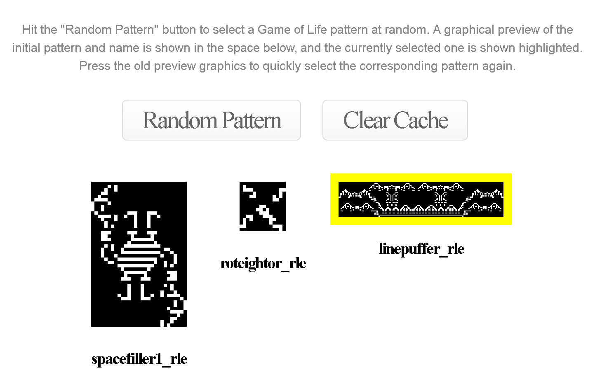
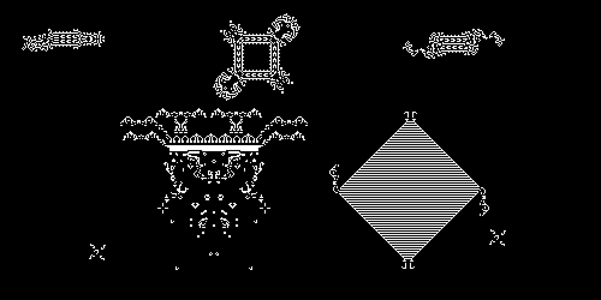

Conway's Game of Life written using Haxe and WebGL. Run it [in your browser](https://www.samcodes.co.uk/project/game-of-life/).

## Features
* Select from thousands of Game of Life patterns, add them to the simulation with one click.
* Speed up, slow down, frame-step, pause and clear the game world.
* Browse, preview and pick the patterns to add interactively.

## Usage

Run the [demo](https://www.samcodes.co.uk/project/game-of-life/), and press anywhere on the Game of Life canvas to add a pattern to the simulation. Here it is in action:

                           |                           
:-------------------------:|:-------------------------:
 | 

You can select from thousands of different Life patterns by clicking on the selection dropdown or previews area further down on the page:

On a high resolution display, the canvas size will be large. The canvas scales by powers of two (1024x512, 1024x1024 etc):

## How It Works
The [Game of Life](https://en.wikipedia.org/wiki/Conway%27s_Game_of_Life) is a [cellular automaton](https://en.wikipedia.org/wiki/Cellular_automaton) invented by [John Conway](https://en.wikipedia.org/wiki/John_Horton_Conway) in 1970. It is a simulation that takes place on a two-dimensional orthogonal grid of square cells, each of which can either be dead or alive.

Each time the simulation is updated, every cell in the grid interacts with its eight neighboring cells in accordance with these four rules:

* Any live cell with fewer than two living neighbours dies (isolation).
* Any cell with two or three living neighbours survives this time (survival).
* Any cell with more than three living neighbours dies (overpopulation).
* Any dead cell with three living neighbours comes to life (reproduction).

Conway designed these rules to produce interesting results - even self replicating patterns can be produced. Read more [here](https://en.wikipedia.org/wiki/Conway%27s_Game_of_Life).

In this implementation, the Game of Life rules are applied in a GLSL shader on a graphics card, using a ping-pong technique with two render targets. One render target contains the current simulation step, and the other receives the results of applying the rules of the game, producing the next simulation step. In other words, we use the output of the last simulation step as input to the next one.

## Notes
* The patterns are from the [LifeWiki](http://www.conwaylife.com/wiki/Main_Page) collection. Credit for these goes to the original creators.
* This project was inspired by [Golly](https://sourceforge.net/projects/golly/), a cross-platform cellular automaton simulator.
* If you have any questions or suggestions then send Sam a message on [Twitter](https://twitter.com/Sam_Twidale) or open an issue.

## License
* The Haxe and webpage code, but not the pattern files, are licensed under the [GPL](https://www.gnu.org/licenses/quick-guide-gplv3.en.html).
* The [noUiSlider](https://github.com/leongersen/noUiSlider) settings sliders are WTFPL.
* The [three.js](https://github.com/mrdoob/three.js/) library is MIT.
